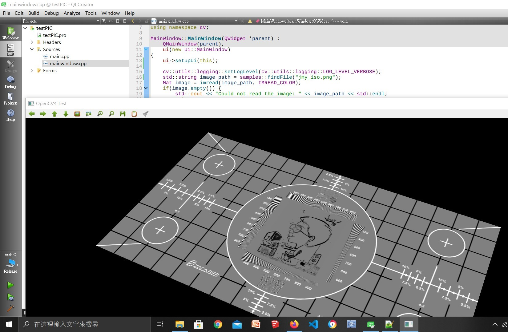
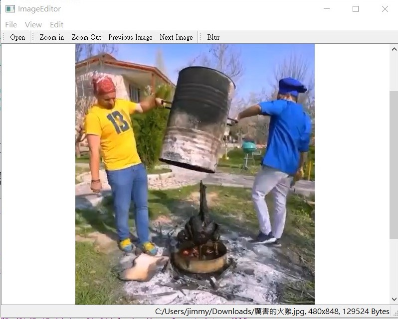
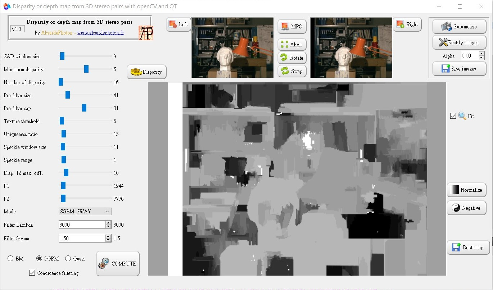

# QT5_Opencv4.4_MinGW 
Build and test on MinGW64bit OpenCV4.4 w/ QT5 (Windows10)

Config OpenCV4.4 w/ following changes:  
                             
| Option  | Modified OpenCV Variables |
| --- | --- |
| v   | WITH_QT _//With QT mouse UI_ |
| v   | WITH_OPENGL |
| v   | CMAKE_CXX_STANDARD_REQUIRED |
| Add | CMAKE_CXX_STANDARD 11_ //Fix undefined reference std:: issue_ | 
| x   | OPENCV_ENABLE_ALLOCATOR_STATS _//Fix error:long_ |
| x   | ENABLE_PRECOMPILED_HEADERS  _//Fix math.h issue_ |
| Add | OPENCV_EXTRA_MODULES_PATH where_saved_path_of_opencv_contrib_modules |  
 
 
 

Rebuild OpenCV w/ Qt5.15.1-MinGW64bit... (remember to add openCV DLL path to system PATH) 

 
 
QT5 test app for loading picture w/ OpenCV...  

  

QT5 test app for image editing w/ OpenCV...  
(from chap.02 in [Qt 5 and Open CV 4 Computer Vision Projects]) 

 

App for adjusting depth map from stereo phtos... 
  

  

## References
  - [OpenCV4.4](https://github.com/opencv) OpenCV Github repository w/ Opencv_contrib
  - [QT5.15](https://www.qt.io/download) _www.qt.io_ Where to download the QT5 framework
  - [Qt 5 and Open CV 4 Computer Vision Projects](https://www.youtube.com/playlist?list=PLeLcvrwLe187K3Ceoe3X3VMAa31591aO8) Watch YouTube clips online
  - [Disparity and depth maps with QT and OpenCV with support for classic image files and MPO stereo pairs](https://github.com/AbsurdePhoton/disparity-filtering-mpo) Depth map project on Github.

